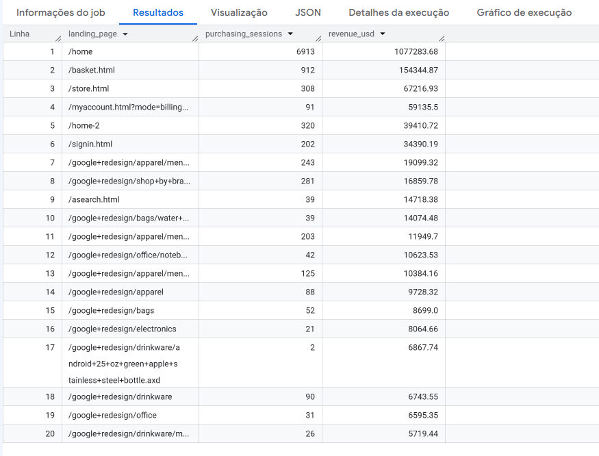
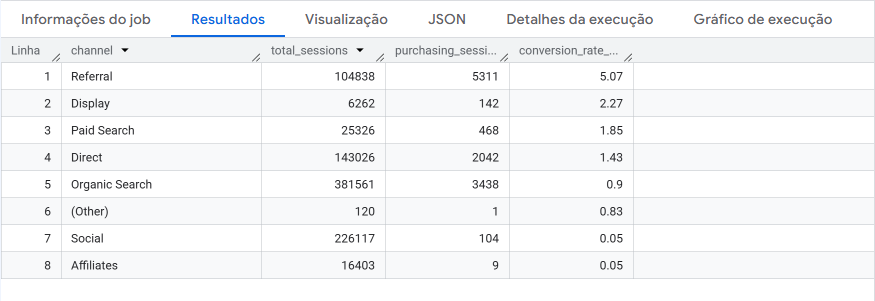
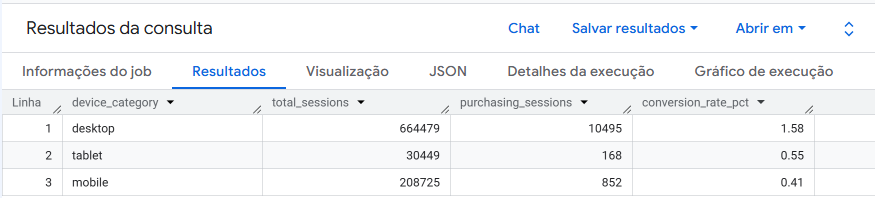
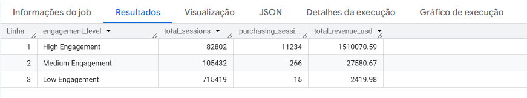

# 📊 Google Analytics Revenue & Conversion Analytics with BigQuery

Business-oriented analytics project using BigQuery, SQL, ARRAY, STRUCT, UNNEST, conversion analysis and revenue insights from Google Analytics sample data.


---

## 🏗️ Project Architecture


---

## 🎯 Business Problem

Companies often track website traffic but struggle to understand:

- Which sessions generate revenue
- Which acquisition channels convert best
- Which landing pages drive purchases
- How user behavior impacts conversion
- Which devices contribute most to sales

This project transforms raw Google Analytics session data into actionable business insights using BigQuery SQL.

---

## 📂 Dataset

### Source

Google Analytics Sample Dataset

```sql
bigquery-public-data.google_analytics_sample.ga_sessions_*
```

### Dataset Characteristics

- User sessions
- Traffic acquisition data
- Device information
- Revenue metrics
- Nested fields (STRUCT)
- Repeated fields (ARRAY)
- Page interaction data

---

## 🛠️ Technologies & SQL Techniques

### ⭐ Advanced BigQuery Features

This project demonstrates practical usage of:

- Nested Data Analysis
- STRUCT fields
- ARRAY fields
- UNNEST()
- Session-level analytics
- Revenue attribution

### Technologies

- Google BigQuery
- Standard SQL

### SQL Techniques

- CTEs
- COUNT()
- COUNTIF()
- SUM()
- ROUND()
- ARRAY
- STRUCT
- UNNEST()

### Analytics Techniques

- Revenue Analysis
- Conversion Analysis
- Funnel Analysis
- Landing Page Analysis
- Device Analysis
- Channel Performance Analysis

---

## 📈 Key Business Insights

### Conversion Performance

- 1,711 sessions analyzed
- 34 purchasing sessions
- 1.99% overall conversion rate

### Revenue Drivers

- Homepage was the main entry point among purchasing sessions
- Revenue generation was concentrated in a small subset of sessions

### Acquisition Performance

- The channel with the highest traffic volume was not the channel with the highest conversion rate
- Referral traffic achieved the best conversion performance

### Customer Behavior

- Desktop users generated nearly all purchases
- Medium-engagement users generated more revenue than highly engaged users

---

## 📊 Visual Evidence

### Landing Pages Revenue Analysis



### Channel Conversion Analysis



### Device Conversion Analysis



### User Engagement Revenue Analysis



---

## 💡 Business Impact

The analysis revealed that:

- Traffic volume alone is not a reliable performance indicator.
- Referral channels generated the highest conversion efficiency.
- The homepage plays a key role in revenue generation.
- Desktop users contributed most purchasing sessions.
- User engagement patterns were not directly correlated with revenue generation.

These findings support more efficient marketing investments and customer journey optimization.

---

## 📁 Repository Structure

```text
google-analytics-revenue-conversion-analysis

├── docs/
│   └── architecture.md
│
├── images/
│   ├── project_architecture.png
│   └── results/
│       ├── business_findings.md
│       ├── channel_conversion_analysis.png
│       ├── device_conversion_analysis.png
│       ├── engagement_revenue_analysis.png
│       └── landing_pages_revenue.png
│
├── sql/
│   ├── 01_revenue_sessions.sql
│   ├── 02_revenue_pages.sql
│   ├── 03_device_conversion_analysis.sql
│   ├── 04_checkout_funnel_analysis.sql
│   ├── 05_top_landing_pages_revenue.sql
│   ├── 06_channel_conversion_analysis.sql
│   ├── 07_country_revenue_analysis.sql
│   └── 08_engagement_revenue_analysis.sql
│
├── README.md
└── LICENSE
```

---

## 📄 Documentation

### Architecture

```text
docs/architecture.md
```

### Business Findings

```text
images/results/business_findings.md
```

---

## 🚀 Skills Demonstrated

- Business Analytics
- SQL for Analytics
- BigQuery
- Nested Data Analysis
- ARRAY & STRUCT
- UNNEST()
- COUNTIF()
- CTEs
- KPI Analysis
- Revenue Analysis
- Conversion Analysis
- Data Storytelling
- Business Insight Generation
- Analytics Engineering

---

## 👨‍💻 Author

Antonio Estevao Moraes

Business Analytics | SQL | BigQuery | Analytics Engineering

📍 Brazil

🔗 GitHub  
https://github.com/aestevaomoraes

🔗 LinkedIn  
https://www.linkedin.com/in/antonio-neto-09518686/
